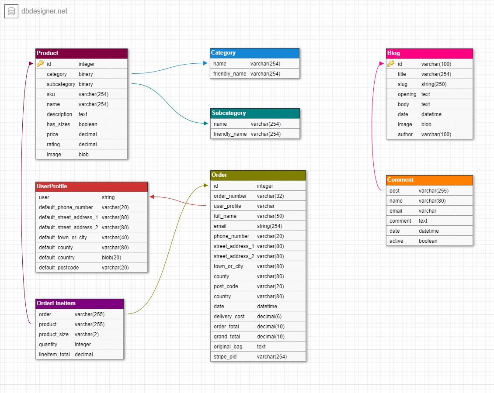
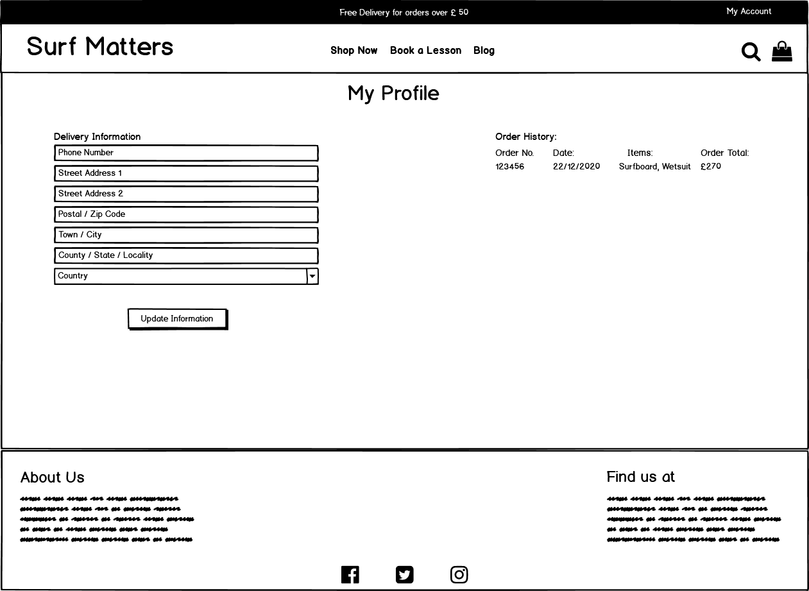

# **Surf Matters**

    

## **About**

Surf Matters is an e-commerce store, specialising in Surf Boards and Wetsuits and Surf Lessons.
The site was built with a friend in mind to showcase what an e-commerce store would look like for them as
they are looking to open a surf shop shortly.

Users are able to browse the products, sort by various categories and filter categories into certain products
and subcategory of products. A product details page enable users to view further information on individual products
and add them to their shopping bag to purchase.

There is also a blog page where users can browse submitted articles and leave comments, users are encouraged
to submit articles themselves via email.

Users are able to register for a new account, and once registered they can login and view their default delivery 
information and previous order history.

The deployed website can be viewed here -[Surf Matters](https://adamp-surf-matters.herokuapp.com/)

## **UX**

The website was designed to be responsive and easy to use and navigate. I designed a home page with an image carousel
of various surfing images, with buton links to the products, surf lessons and blog.

The site is easy to navigate, users can use the menu links in the navigation bar at the top of the page,
and each page has a consistent layout to it with the header and footer replicatred across the site. 
this gives users a familiar feel to each page when navigating the site.

I chose black and white as the main colours for the site as the surfing, product and blog images
are quite colourful due to the nature of their content.

### _**Site Goals**_

The overall aim of the site is to enable users to access the online store for the Surf Matters
surf shop. It is designed to be somewhere that Surf Matters can showcase their products online and 
also sell other services they offer to a far wider audience than the just the people who visit their
shop. 

The inclusion of a blog is designed to give the store a community feel, users are encouraged to email in an 
article for the site owner to approve before posting.

### _**Target Audience**_ 

The website is aimed at but not restricted to the following users :

* People wanting to buy surf products.
* People wanting to learn to surf.
* Site owner to increase sales and manage products.
* People wanting to find surf shops local to them.

### _**User Stories**_

| User Story ID | As A/AN            | I want to be able to...                      | So that I can..                                                                |
|---------------|--------------------|----------------------------------------------|--------------------------------------------------------------------------------|
|               |                    | **Viewing and navigation**                   |                                                                                |
| 1             | Shopper            | View all products.                           | Select what I would like to purchase.                                          |
| 2             | Shopper            | View individual product details.             | See the price, product description and any other information about the product.|
| 3             | Shopper            | Add items to a shopping bag.                 | Review what I want to purchase.                                                |
| 4             | Shopper            | View the total of my purchases.              | Avoid over spending.                                                           |
|               |                    | **Registration and User Accounts**           |                                                                                |
| 5             | Site User          | Register for an account.                     | Have a profile with saved details such as delivery address and previous orders.|
| 6             | Site User          | Login and logout.                            | Access my personal information.                                                |
| 7             | Site user          | Receive email comfirmation after registering.| Check that my account registration was a success.                              |
| 8             | Site User          | Recover my password if I forget it.          | Maintain aceess to my account.                                                 |
|               |                    | **Purchasing and checkout**                  |                                                                                |
| 9             | Shopper            | Select the size and quantity of a product.   | Make sure I purchase the correct product for me.                               |
| 10            | Shopper            | View items in my bag before purchase.        | Check the cost and items that I want to buy.                                   |
| 11            | Shopper            | Amend or delete items in my bag.             | Make changes if I change my mind about certain purchases.                      |
| 12            | Shopper            | Securely make a payment.                     | Be confident my personal details are not shared with anyone.                   |
|               |                    | **Sorting and searching**                    |                                                                                |
| 13            | Shopper            | Sort the list of products.                   | Find the best price or best rated product.                                     |
| 14            | Shopper            | View products by category.                   | View specific products that I am in interested in.                             |
| 15            | Shopper            | Search for a product by name.                | Find a specific product I am in terested in.                                   |
|               |                    | **Admin and Product Management**             |                                                                                |
| 16            | Site / Store Owner | Add a product.                               | Increase the product range I am selling.                                       |
| 17            | Site / Store Owner | Edit a product.                              | Change product prices, descriptions etc.                                       |
| 18            | Site / Store Owner | Delete a product.                            | Remove products that are no longer available.                                  |
|               |                    | **Blogs**                                    |                                                                                |
| 19            | Site User          | Read blog articles.                          | Read about a subject of interest to me.                                        |
| 20            | Site User          | Comment on a blog article.                   | Let the author know how I felt about their post.                               |

## _**Database Schema**_

The databases were stored in [sqlite3](https://docs.python.org/3/library/sqlite3.html) in development, and [heroku postgres](https://www.heroku.com/postgres) in
production. A number of different models are used throughout the site as detailed in the database schema below.

 

    

 

#### Product model

The product model holds all the information relating to products sold in the store, it has two froeign keys, those being
category and subcategory, and is also a Foreign Key to the OrderLineItem model.

| Field       | Type                |
|-------------|---------------------|
| category    | models.ForeignKey   |
| subcategory | models.ForeignKey   |
| sku         | models.Charfield    |
| name        | models.Charfield    |
| description | models.TextField    |
| has_sizes   | models.BooleanField |
| price       | models.DecimalField |
| rating      | models.DecimalField |
| image       | models.ImageField   |

#### Category and Subcategory models

The Category and Subcategory models are identical, both contain two fields. A name field which is used in the back end. The 
other field is a friendly_name which is used to display the name to the end user.

| Field         | Type             |
|---------------|------------------|
| name          | models.Charfield |
| friendly_name | models.Charfield |

#### Order model

The order model is created in the checkout app, and is used to handle all orders across the site. It takes
the user_profile as a Foreign key to bring across registered users stored details.

| Field            | Type                 |
|------------------|----------------------|
| order_number     | models.CharField     |
| user_profile     | models.ForeignKey    |
| full_name        | models.CharField     |
| email            | models.EmailField    |
| phone_number     | models.CharField     |
| street_address_1 | models.CharField     |
| street_address_2 | models.CharField     |
| town_or_city     | models.CharField     |
| county           | models.CharField     |
| post_code        | models.CharField     |
| country          | models.CountryField  |
| date             | models.DateTimeField |
| delivery_cost    | models.DecimalField  |
| order_total      | models.DecimalField  |
| grand_total      | models.DecimalField  |
| original_bag     | models.TextField     |
| stripe_pid       | models.CharField     |

#### OrderLineItem model

The order line item model is used to create an order line for each product in the shopping bag. It takes in the order as a 
Foreign Key this enable us to access orders and make certain calls on them. It also takes in product as a Foreign Key, which
gives it access to all the associated fields of that model.

| Field          | Type                |
|----------------|---------------------|
| order          | models.ForeignKey   |
| product        | models.ForeignKey   |
| product_size   | models.CharField    |
| quantity       | models.IntegerField |
| lineitem_total | models.DecimalField |

#### UserProfile model

The UserProfile model is used to store a customers default delivery information, and also to provide a record of their
order history. It has **user** as a OneToOneField which specifies that each user can only have one profile,
and each profile can be attached to one user.

| Field                    | Type                 |
|--------------------------|----------------------|
| user                     | models.OneToOneField |
| default_phone_number     | models.CharField     |
| default_street_address_1 | models.CharField     |
| default_street_address_2 | models.CharField     |
| default_town_or_city     | models.CharField     |
| default_county           | models.CharField     |
| default_country          | models.CountryField  |
| default_postcode         | models.CharField     |

#### Blog model

The blog model holds all the data for the individual blogs. The slug field is used to create a URL
for each individual blog item.

| Field   | Type                 |
|---------|----------------------|
| title   | models.Charfield     |
| slug    | models.SlugField     |
| opening | models.TextField     |
| body    | models.TextField     |
| date    | models.DateTimeField |
| image   | models.ImageField    |
| author  | models.Charfield     |

#### Comment model

The comment model is used to add comments to the blog articles.

| Field   | Type                 |
|---------|----------------------|
| post    | models.ForeignKey    |
| name    | models.Charfield     |
| email   | models.EmailField    |
| comment | models.TextField     |
| date    | models.DateTimeField |
| active  | modesl.BooleanField  |

## **Wireframes**

### _**Home Page**_
 

    

 

### _**Registration Page**_
 

    

 

### _**Login Page**_
 

    

 

### _**Products Page**_
 

    

 

### _**Individual Product Page**_
 

    

 

### _**Surf Lessons Page**_
 

    

 

### _**Individual Surf Lessons Page**_
 

    

 

### _**Blog Page**_
 

    

 

### _**Checkout Page**_
 

    

 

### _**Shopping Bag Page**_
 

    

 

### _**Profile Page**_
 

    

 

## **Features**

* **Navigation Bar** - The site features a consistent navigation bar, it uses [Bootstrap](https://getbootstrap.com/docs/4.0/components/navbar/) responsive navbar, it is easy to use and 
collapses down on smaller devices.

* **Search Box** - The navigation bar has a search box, where users can enter search terms to search for relevant products in the store.

* **Product Sorting** - Users have the ability to sort products by name, price and rating.

* **Product Filtering** - Users can filter products by category and subcsategory.

* **Shopping bag** - Users are able to add products to their shopping bag whilst browsing the store. When viewing the bag they can update (i.e. change sizes), or
remove products they no longer wish to purchase.

* **Toast Messages** - The site features [Bootstrap](https://getbootstrap.com/docs/4.3/components/toasts/) toast messages. Users get success messages when performing operations
such as logging in and out and adding products to their bag. Users also reveive error, info and warning messsages. 

* **Account Registration** - Users are able to enter their details and register for an account.

* **Profile Page** - Users get a profile page, which stores their default delivery information and previous order history.

* **Secure Checkout** - User can checkout and purchase goods securely, the site utilises [Stripe](https://stripe.com/gb), a secure online payment
processing facility.

* **Blog Comments** - Users are able to add their comments to the blog articles, using a form at the bottom of each blog article. The comments
are then displayed underneath the article.

## **Technologies Used**

[HTML5](https://en.wikipedia.org/wiki/HTML5) - Used to provide the structure and content of the templates.

[CSS](https://en.wikipedia.org/wiki/Cascading_Style_Sheets) - Provides some of the styling for the site.

[Bootstrap](https://getbootstrap.com/) - Utilised for a lot of the styling of the site such as prodcut card and forms. Also used to make the site responsive.

[Python](https://www.python.org/) - The main code used in the back end with Django.

[Django](https://www.djangoproject.com/) - A Python web framework used to create the website.

[Django allauth](https://django-allauth.readthedocs.io/en/latest/index.html) - Used for account authentication, registration and account management.

[Django crispy forms](https://django-crispy-forms.readthedocs.io/en/latest/) - Used for styling the websites forms, to make them match the Bootstrap theme.

[Jinja](https://jinja.palletsprojects.com/en/2.11.x/) - Used as a templating language with Django and Python.

[Stripe](https://stripe.com/gb) - A secure online payment processing facility, used for processing customer payments.

[Sqlite3](https://www.sqlite.org/index.html) - Used for storing the databases when in develoment.

[Heroku Postgres](https://www.heroku.com/postgres) - Used for storing the databases in production.

[jQuery](https://jquery.com/) - USed for functionality of the site such as the Bootstrap carousel and stripe elements.

[Google Fonts](https://fonts.google.com/) -  The site uses the Oswald and Roboto fonts.

[Font Awesome](https://fontawesome.com/) - Used for the icons throughout the app.

[Git](www.github.com) - Used for version control, and tracking changes in the repository.

[Heroku](https://www.heroku.com/) - The platform used to deploy the app.

## **Testing**

A lot of the testing was carried out in develoment, using the developer tools in Google Chrome. I found this the most productive way of testing as I found
that I could fix issues found as I went along. The developer tools also assisted me in testing the responsiveness of the site.

### _**User Story Tests**_

I have created a separate file for the user story tests, you can find them by clicking [here](files/user_story_tests/testing.md)

