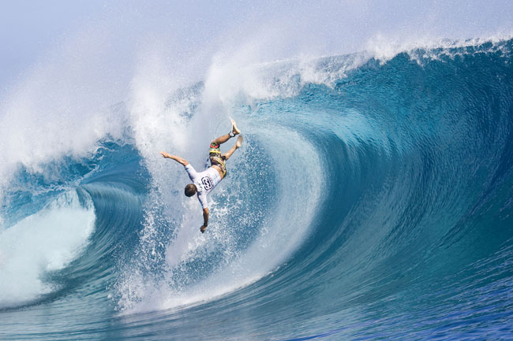

# **Surf Matters**

    

## **About**

Surf Matters is an e-commerce store, specialising in Surf Boards and Wetsuits and Surf Lessons.
The site was built with a friend in mind to showcase what an e-commerce store would look like for them as
they are looking to open a surf shop shortly.

Users are able to browse the products, sort by various categories and filter categories into certain products
and subcategory of products. A product details page enable users to view further information on individual products
and add them to their shopping bag to purchase.

There is also a blog page where users can browse submitted articles and leave comments, users are encouraged
to submit articles themselves via email.

Users are able to register for a new account, and once registered they can login and view their default delivery 
information and previous order history.

The deployed website can be viewed here -[Surf Matters](https://adamp-surf-matters.herokuapp.com/)

## **UX**

The website was designed to be responsive and easy to use and navigate. I designed a home page with an image carousel
of various surfing images, with buton links to the products, surf lessons and blog.

The site is easy to navigate, users can use the menu links in the navigation bar at the top of the page,
and each page has a consistent layout to it with the header and footer replicatred across the site. 
this gives users a familiar feel to each page when navigating the site.

I chose black and white as the main colours for the site as the surfing, product and blog images
are quite colourful due to the nature of their content.

[User Stories](./files/Surf_Matters_User_Stories.xlsx)

